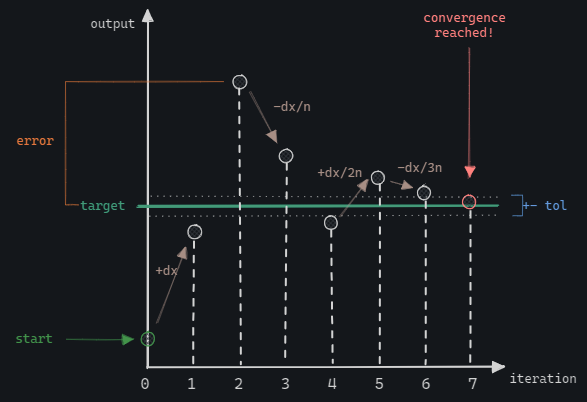
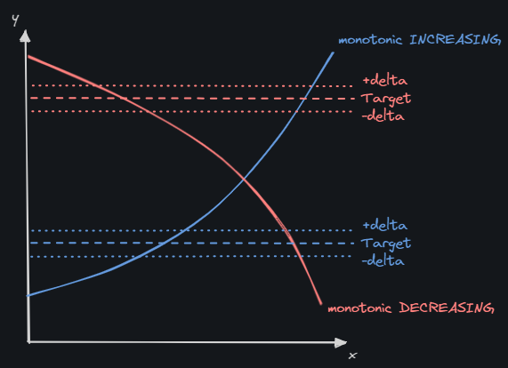
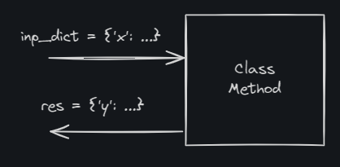

# DOC - Numerical Convergence
- [DOC - Numerical Convergence](#doc---numerical-convergence)
  - [`nc_function_args`](#nc_function_args)
  - [`nc_function_dict`](#nc_function_dict)
  - [Guidelines for Usage](#guidelines-for-usage)

---

- [ ] `#i` function `y=f(x, z)`, with both `x` and `z` to be varied (i.e. nested `while` loops)
- ✅ `#i` extend to no-monotonic functions/methods: find the convergence near to a initial value

To be applied to both functions and class methods.

> Hypotheses: 
> - function trend given: monotone functions/methods only.
> - function trend NOT given: the function/method trend is automatically detected by the solver, and the solution found will be near to the initial point.



Calculation parameters:

- $x$ : `o` variable  parameter, independent variable
- $y$ : `o` output, it is the dependent variable
- $x_0$ : `i` initial value of $y$
- $x_{i-1}$ : `o` variable parameter of the previous run, to be used when there are limit to be imposed to $x$ (e.g. min or max value) and exit the loop since that limits are reached in both the $i$ and $i-1$ runs (`convergence reached due to boundaries of the independent varaible`)
- $x_{min}$ :  $x$ minimum allowed value (opt.)
- $x_{max}$ : $x$ maximum allowed value (opt.)
- $y_T$ : `i` target value of $y$
- $\delta_y$ : `i` tolerance to evaluate the convergence of the independent variable
- $\epsilon$ : `o` error between two consecutive simulations 
- $\Delta_0$ : `i` initial variation of $x$
- $\Delta$ : `o` current variation of $x$
- $n$ : `i` delta scaling, factor that scales the initial delta at each sign variation of $\epsilon$
- $s_i$ : `o` sign of $\epsilon$, it can assume the values `(-1,1)` and  needs to be initialized with one of the two values



Convergence iteration code:

```python
if trend:
	"Monotonic Increasing with x"
	if y > y_t + tol:
		if inc == 1:
			inc = -1
			delta /= delta_scaler
		x -= delta
	elif y < y_t - tol:
		if inc == -1:
			inc = 1
			delta /= delta_scaler
		x += delta
else:
	"Monotonic Decreasing with x"
	if y < y_t - tol:
		if inc == 1:
			inc = -1
			delta /= delta_scaler
		x -= delta
	elif y > y_t + tol:
		if inc == -1:
			inc = 1
			delta /= delta_scaler
		x += delta
```

## `nc_function_args`

Numerical convergence for functions with explicit input and output arguments.

- single variable function `y=f(x)`
- multiple variables fucntion `y=f(x, x1, x2, x3, ...)`

```python
nc_function(settings, function, *args)
```

where:

```python
function(x)
function(x, *args)
```

```text
    Convergence method applied to function with arguments:
    - settings:
        - 'tol': float, tolerance value to assess the convergence
        - 'delta': float, initial value for independent variable variation
        - 'delta_scaler': float, scaler value that divides the delta
        - 'x_0': float, initial value of independent variable
        - 'x_min': float, [opt.] minimum allowed value for independent variable
        - 'x_max': float, [opt.] maximum allowed value for independent variable
        - 'y_t': float, output variable target
        - 'trend': bool, default=None, function trend, monotonic increasing (True) or decreasing (False).
                    If None, the trend is assessed automatically.
        - 'count_max': int, maximum number of iterations
        - 'DEBUG': bool, enables debugging printouts
        - 'printout': print final result
    - function: function on which the convergence value must be reached. The function can
            be implemented on a single input or multiple ones. In case of multiple variables
            are needed by the function (i.e. len(args)>0) only the first one is varied to reach the convergence:
        - f(x) = y : single variable function
        - f(x1, x2, x3, ...) = y : multiple variables function
    - args: additional function inputs, they are not varied inside the convergence. 
            Not needed for single variable functions.
```

## `nc_function_dict`

Convergence method applied to functions/methods:

- the function interface is a `dict` for the inputs and a `dict` for the outputs.
- the input dictionary contains the main variable `x` to be set in order to reach the convergence
- all the other inputs for the method are contained into the input dicitonary
- the output dictionary contains the variable `y` to be monitored in order to assess the convergence



```
    Convergence method applied to function dictionary (both input and output):
    - settings:
        - 'tol': float, tolerance value to assess the convergence
        - 'delta': float, initial value for independent variable variation
        - 'delta_scaler': float, scaler value that divides the delta
        - 'x_name': str, independent variable name (i.e. dictionary key)
        - 'x_0': float, initial value of independent variable
        - 'x_min': float, [opt.] minimum allowed value for independent variable
        - 'x_max': float, [opt.] maximum allowed value for independent variable
        - 'y_t_name': str, output variable name (i.e. dictionary key)
        - 'y_t': float, output variable target
        - 'trend': bool, default=None, function trend, monotonic increasing (True) or decreasing (False).
                    If None, the trend is assessed automatically.
        - 'count_max': int, maximum number of iterations
        - 'DEBUG': bool, enables debugging printouts
        - 'printout': print final result
    - function: function on which the convergence value must be reached. The function can
            be implemented on a single input or multiple ones. In case of multiple variables
            are needed by the function (i.e. len(args)>0) only the first one is varied to reach the convergence:
        - f(x) = y : single variable function
        - f(x1, x2, x3, ...) = y : multiple variables function
    - args: additional function inputs, they are not varied inside the convergence. 
            Not needed for single variable functions.
```

## Guidelines for Usage

[Development and Examples Notebook](../dev/dev_numerical-convergence.ipynb)

Guidelines:

- Monotonic Incrementing function: `'trend': True`
- Monotonic Decrementing function: `'trend': False`
- A function that returns **multiple values** will need a decorator that will make it compliant with the convergence functions requirement for **single** returned value

---

[<< Home](../readme.md)