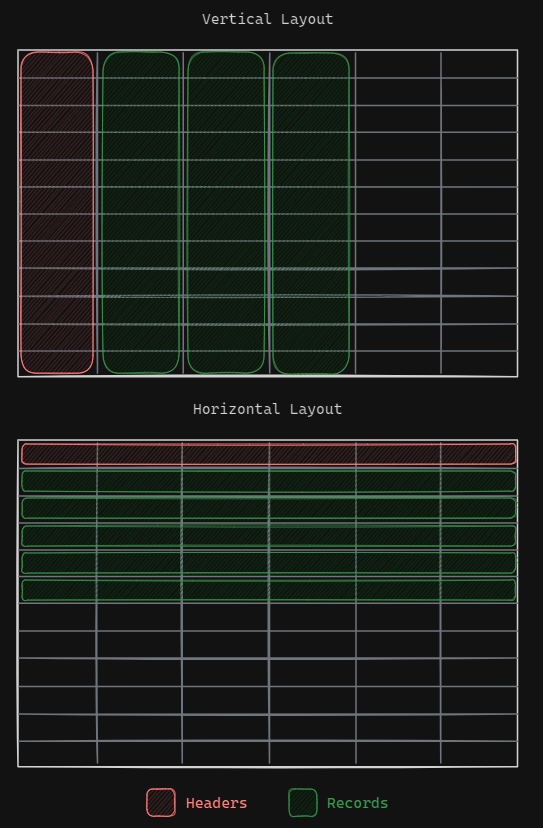

# DOC - Table Printout

- [DOC - Table Printout](#doc---table-printout)
- [Arguments](#arguments)
- [Functions](#functions)
  - [`_to_str`](#_to_str)
  - [`_check_consistency`](#_check_consistency)
  - [`_calc_max_width_horiz`](#_calc_max_width_horiz)
  - [`_calc_max_width_vert`](#_calc_max_width_vert)
  - [`_build_table_horiz`](#_build_table_horiz)
  - [`_build_table_vert`](#_build_table_vert)
  - [`_import_settings`](#_import_settings)
  - [`build_table`](#build_table)
  - [`print_table_vert`](#print_table_vert)
  - [`print_table_horiz`](#print_table_horiz)
- [Classes](#classes)
  - [`TablePrintout`](#tableprintout)
    - [Public Methods](#public-methods)

---

Printout of tables with good-looking formatting. Both **vertical** and **horizontal** layouts are provided.



Features:

- horizontal and vertical layout
- automatic column spacing (i.e. based on max width)
- formatting for **markdown** rendering
- export table to file

[Examples](../dev/dev_table_printout.ipynb)

# Arguments

In order to ease the module usage, the main arguments handled and manipulated by all the functions and the classes have unique names. Here below a brief list with the 
extensive description.

- `headers`: list, the table headers;
- `records`: list[list], the table records (i.e. content);
- `settings`: dict, settings for table formatting.

# Functions

## `_to_str`

- Private
- Base function

```text
    Convert the content of the provided lists to string.
    Input lists are copied to avoid issues due to list mutability.
    - headers: list[any], list of the table headers
    - records: list[list[any]], list of the records (i.e. table content)
    Returns:
    - h_str: list[str]: 
    - r_str: list[list[str]]
```

## `_check_consistency`

- Private
- Base function

```text
    The size consistency of headers and all the records is checked.
    - headers: list[any], list of the table headers
    - records: list[list[any]], list of the records (i.e. table content)
    Returns:
    - ValueError: an error is raised when the input are not consistent
    - bool: a True is returned if the consistency is checked
```

## `_calc_max_width_horiz`

- Private
- 1st level function. Uses:
  - `_to_str`: the list content is converted to string to measure the column width.

```text
    Calculate the maximum column width by considering additional spacing and compares it with a user defined value. The maximum spacing between the calculated and the user defined is used. Horizontal layout.
    - headers: list[any], list of the table headers
    - records: list[list[any]], list of the records (i.e. table content)     
    - spaces : int, default=2, additional spacing to the width measured
    - widt   : int, default=None, user defined width
    Return
    - col_len: list[int], the width of each column
```
 
## `_calc_max_width_vert`

- Private
- 1st level function. Uses:
  - `_to_str`: the list content is converted to string to measure the column width.

```text
    Calculate the maximum column width by considering additional spacing and compares it with a user defined value. The maximum spacing between the calculated and the user defined is used. Vertical layout.
    - headers: list[any], list of the table headers
    - records: list[list[any]], list of the records (i.e. table content)     
    - spaces : int, default=2, additional spacing to the width measured
    - widt   : int, default=None, user defined width
    Return
    - col_len: list[int], the width of each column
```
 
## `_build_table_horiz`

- Private
- 1st level function. Uses:
  - `_calc_max_width_horiz`: the width of all the columns is calculate

```text
    Build the table as string, horizontal layout:
    - headers: list[str], list of the table headers
    - records: list[list[str]], list of the records (i.e. table content)    
    - settings: dict, settings dictionary
    Returns:
    - s: str, the table
```
 
## `_build_table_vert`

- Private
- 1st level function. Uses:
  - `_calc_max_width_horiz`: the width of all the columns is calculate

```text
    Build the table as string, vertical layout:
    - headers: list[str], list of the table headers
    - records: list[list[str]], list of the records (i.e. table content)    
    - settings: dict, settings dictionary
    Returns:
    - s: str, the table formatted as string
```
 
## `_import_settings`

- Private
- Base function

A deepcopy of the input dictionary is returned

```text
    Handling of settings for table printout. Default values are provided when not
    available and non-allowed values are corrected.
    - settings:dict, parameters that defines the table built
        - "positioning": str, default="horiz"
            - "horiz": horizontal table positioning, i.e. records to rows
            - "vert" : vertical table positioning, i.e. records to columns
        - "spaces"    : int, default=2, additional chars to cell width
        - "width"     : int, default=None, user-defined columng width
        - "markdown"  : bool, table styled for markdown rendering 
        - "separator" : str, separator character between two columns
        - "export"    : bool, default=False, file export flag
        - "folder"    : str, default="", folder of the exported file
        - "filename"  : str, default="table.txt"
        - "printout"  : bool, default=False, flag for the table printout
    Returns:
    - settings: dict, settings dictionary copied from the input one and properly modified
```
 
## `build_table`

- Public
- 2nd level function. Uses:
  - `_check_consistency`
  - `_import_settings`
  - `_build_table_vert`
  - `_build_table_horiz`

```text

```
 
## `print_table_vert`

- Public
- 3rd level function. Uses:
  - `_import_settings`
  - `build_table`

The table layout is forced to vertical even if in the dictionary it is set as horizontal.

```text
    Print vertical layout table:
    - headers: list[any], list of the table headers
    - records: list[list[any]], list of the records (i.e. table content)
    - settings: dict, default={}, settings dictionary
    Returns:
    - None
```
 
## `print_table_horiz`

- Public
- 3rd level function. Uses:
  - `_import_settings`
  - `build_table`

The table layout is forced to horizontal even if in the dictionary it is set as vertical.

```text
    Print horizontal layout table:
    - headers: list[any], list of the table headers
    - records: list[list[any]], list of the records (i.e. table content)
    - settings: dict, default={}, settings dictionary
    Returns:
    - None
```
 

# Classes

## `TablePrintout`

The class is intended to store the headers-records content into an object and handlie it multiple times.

```text
    - headers: list[any], table headers
    - records: list[list[any]], table content
    - settings:dict, parameters that defines the table built
        - "positioning": str, default="horiz"
            - "horiz": horizontal table positioning, i.e. records to rows
            - "vert" : vertical table positioning, i.e. records to columns
        - "spaces"    : int, default=2, additional chars to cell width
        - "width"     : int, default=None, user-defined columng width
        - "markdown"  : bool, table styled for markdown rendering 
        - "separator" : str, separator character between two columns
        - "export"    : bool, default=False, file export flag
        - "folder"    : str, default="", folder of the exported file
        - "filename"  : str, default="table.txt"
        - "printout"  : bool, default=False, flag for the table printout
```

### Public Methods

- `build_table`: build table and stores it into `.table` attribute
- `print_table`: printout table
- `export`: export table into a file, by default "export.txt" in the same folder of the script

---

[<< Home](../readme.md)